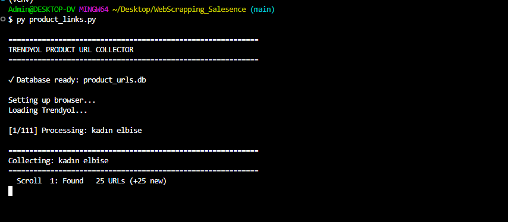
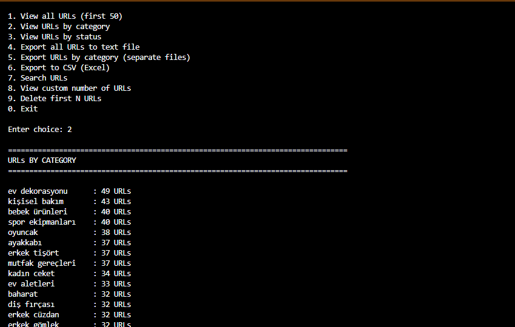
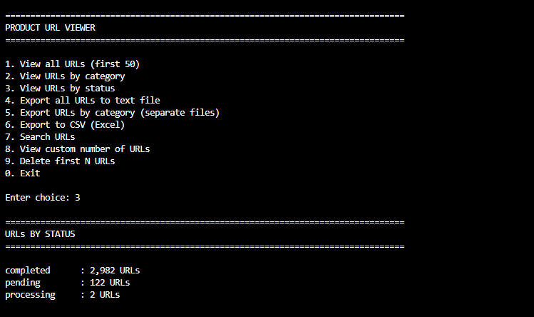
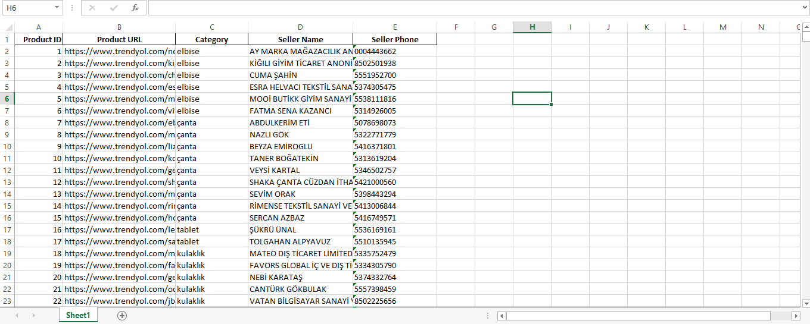

# Project Overview

This project is a web scraper developed using Selenium, aimed at extracting data from web pages easily and efficiently.

## Installation Instructions

1. Clone the repository:
   ```bash
   git clone https://github.com/Dhanush0724/Salesence_web_scrapper.git
   ```

2. Change directory to the project folder:
   ```bash
   cd Salesence_web_scrapper
   ```

3. Install the required packages:
   ```bash
   pip install -r requirements.txt
   ```

## Usage Guide

To run the web scraper, execute the following command:
```bash
python main.py
```

## Features
- **Data Extraction**: Efficiently extracts data from multiple websites.
- **Selenium-Based**: Utilizes Selenium for navigating web pages and interacting with page elements.
- **Customizable Settings**: Users can configure various settings to tailor the scraping process.

## Technologies Used
- Python
- Selenium
- BeautifulSoup
- Requests

## Database Schema

The database consists of the following tables:
1. **Users**: Stores user details.
   - id (Primary Key)
   - username
   - email
   - created_at

2. **ScrapedData**: Stores information extracted from websites.
   - id (Primary Key)
   - user_id (Foreign Key)
   - data_field_1
   - data_field_2
   - scraped_at

## Screenshots







## Troubleshooting Guide
- If you encounter any issues, please ensure that all dependencies are installed correctly.
- Check the version of Python and Selenium; incompatibility may cause errors.

## Contribution Guidelines

1. Fork the project.
2. Create a new branch (`git checkout -b feature-branch`).
3. Make your changes and commit them (`git commit -m 'Description of changes'`).
4. Push to the branch (`git push origin feature-branch`).
5. Submit a pull request.

For more information or to report an issue, please contact the project maintainer.
